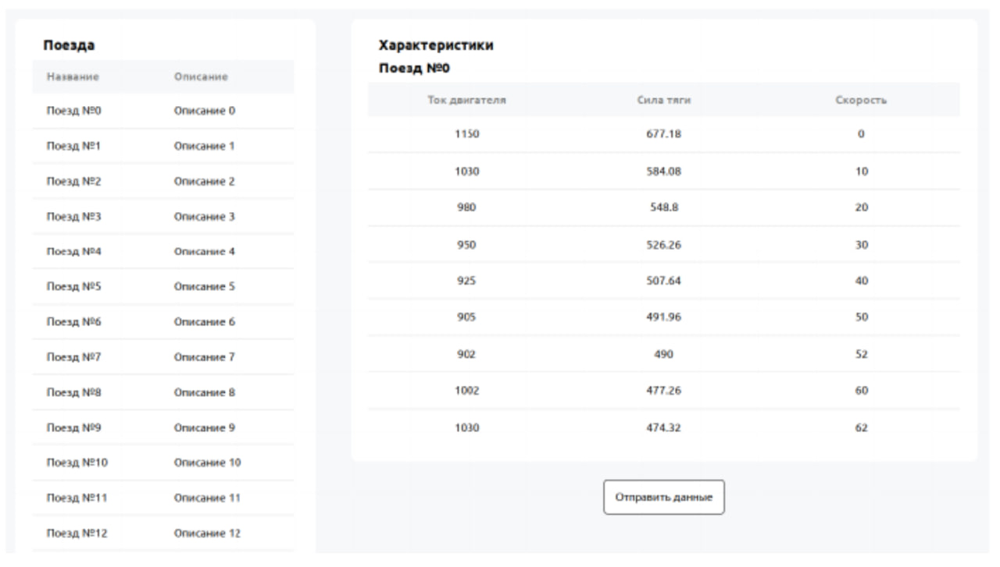

# Задание

### Требуется создать фронтенд приложение на React.js.

- Изначально в окне должна быть нередактируемая таблица со списком поездов.
- При клике на строку с поездом должна появляться еще одна таблица — с характеристиками,
  которые соответствуют выбранному поезду. Характеристика представляет собой массив объектов с тремя полями:
  - <i><strong>скорость в км/ч</strong></i>
  - <i><strong>сила тяги в кН</strong></i>
  - <i><strong>ток двигателя в А</strong></i>
- Все ячейки таблицы характеристик должны быть доступны пользователю для редактирования.
- Программа же должна проверять пользовательский ввод на соответствие следующим условиям:
  - <i><strong>скорость — неотрицательное целое число</strong></i>
  - <i><strong>сила тяги — положительное число с плавающей запятой</strong></i>
  - <i><strong>ток двигателя — положительное целое число</strong></i>
- Гарантируется, что загружаемые данные валидны.
- Если в таблице присутствуют значения, которые не проходят валидацию, то они подсвечиваются красным, а кнопка <i><strong>«Отправить данные»</strong></i> становится неактивной (на неё нельзя нажать).
- Если данные проходят валидацию, то при нажатии пользователем на кнопку <i><strong>«Отправить данные»</strong></i> в консоли браузера выводится список скоростных ограничений, отсортированных по возрастанию.

### Обязательные требования

- Приложение должно быть реализовано на Typescript с использованием React 16+ и Redux.
- Верстка таблиц должна быть реализована через table (не div-ми).

### Будет плюсом

- Оптимизировать количество перерисовок компонентов.
- Не использовать тип any.

---

### Задача выполнена с использованием <i>React 18</i>, <i>RTK</i>, <i>TypeScript</i>, <i>SCSS</i> и <i>Tailwind</i>.

Первичная загрузка данных в стор происходит при инициализации приложения. Сам стор состоит из двух частей:

- <i><strong>Trains</strong></i> - основное хранилище данных, которое не изменяется во время жизненного цикла приложения
- <i><strong>Characteristics</strong></i> - характеристики выбранного поезда, на основе которых работает таблица редактирования. При выборе поезда из 1й таблицы, загружаются данные из <i><strong>Trains</strong></i>, создавая локальную копию для редактировния, с которой и происходит всё дальнейшее взаимодействие

В приложении присутствует двухуровневая валидация данных:

- Первичная валидация происходит на уровне инпутов, не позволяющих пользователю ввести отрицательные значения. Для полей `force` и `engineAmperage`, значения которых должны быть строго больше нуля, присутстует дополнительная проверка на ненулевое значение. При нулевом значение выводится подсказка.
- Вторичная валидация происходит на уровне стора, производится проверка всех значений и, в случае обнаружения невалидного значения, форма отправки блокируется, не позволяя пользователю отправить данные.

---

# [Решение](https://trains-form.onrender.com)
